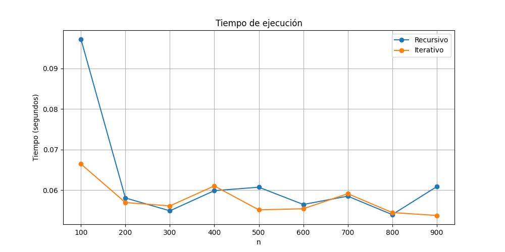
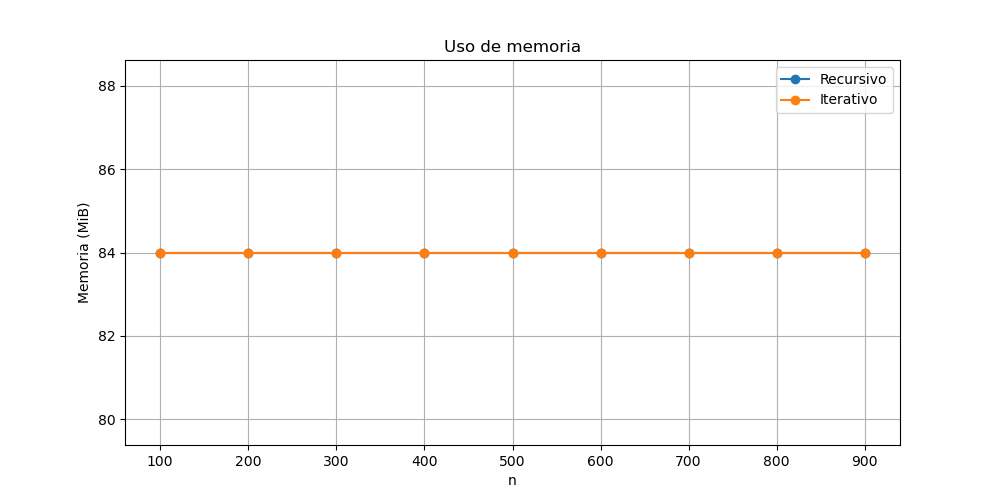

# Comparación de Eficiencia: Factorial Recursivo vs Iterativo en Python y C

## 📌 Propósito de la tarea
El objetivo de esta tarea es comparar la eficiencia de dos implementaciones para calcular el factorial de un número entero `n`: una versión recursiva y una versión iterativa.  
Se busca medir el tiempo de ejecución y el uso de memoria de ambas implementaciones en **Python** y **C**, y presentar los resultados de forma gráfica para analizar sus diferencias.

---

## 🛠 Implementación de las funciones

### Python
- **Recursiva (`facto_r`)**: utiliza llamadas a sí misma hasta llegar a un caso base (`n == 0` o `n == 1`).
- **Iterativa (`facto_i`)**: usa un bucle `for` para multiplicar secuencialmente desde 1 hasta `n`.

### C
- **Recursiva (`facto_r`)**: misma lógica que en Python, usando llamadas a sí misma.
- **Iterativa (`facto_i`)**: utiliza un bucle `for` para realizar el cálculo de forma directa.

---

## ⏱ Métodos para medir tiempo y memoria

### En Python
- **Tiempo de ejecución**: módulo [`time`](https://docs.python.org/3/library/time.html), registrando el tiempo antes y después de ejecutar la función.
- **Uso de memoria**: módulo [`memory_profiler`](https://pypi.org/project/memory-profiler/) para registrar el consumo máximo de memoria.

### En C
- **Tiempo de ejecución**: función [`clock()`](https://cplusplus.com/reference/ctime/clock/) de `<time.h>`.
- **Uso de memoria**: función [`getrusage()`](https://man7.org/linux/man-pages/man2/getrusage.2.html) de `<sys/resource.h>` para obtener el uso máximo de memoria en KB.

---

## 📊 Resumen de hallazgos
- **Tiempo de ejecución**: en nuestras mediciones, el método iterativo fue más rápido que el recursivo tanto en Python como en C.
- **Uso de memoria**: en nuestras pruebas, tanto en C como en Python, el uso de memoria fue prácticamente igual para ambas implementaciones.  
  Teóricamente, se esperaría que la recursiva consuma más memoria por el uso de la pila de llamadas, pero en este caso no se observó diferencia notable. Esto podría deberse a:
  - Optimización interna del lenguaje o compilador.
  - Forma en que el sistema operativo gestiona la memoria.
  - Precisión o granularidad de la herramienta de medición utilizada.

---

## 📈 Comparaciones gráficas

### Tiempo de ejecución

### Uso de memoria

---

## 🚀 Conclusión
- Según los resultados obtenidos, la **iteración** fue más rápida que la recursión, lo cual es consistente con la teoría en términos de tiempo de ejecución.
- El **uso de memoria** fue prácticamente igual en ambas implementaciones, lo que difiere de lo esperado teóricamente.  
- Este resultado anómalo destaca la importancia de medir y analizar experimentalmente, ya que las condiciones del entorno, las optimizaciones y las herramientas pueden influir en los datos obtenidos.